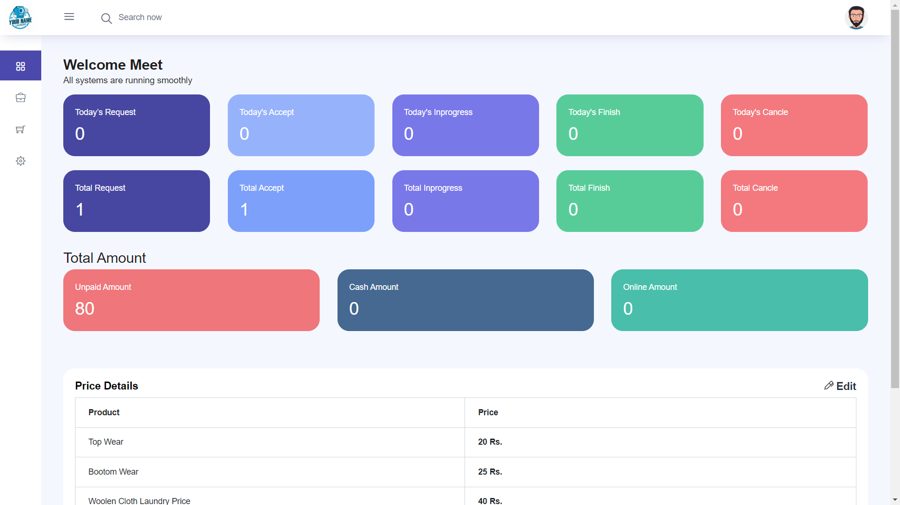
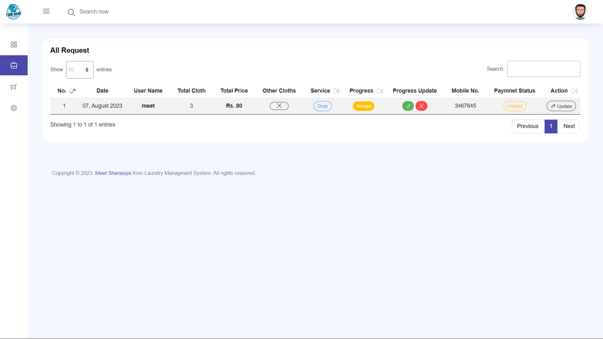
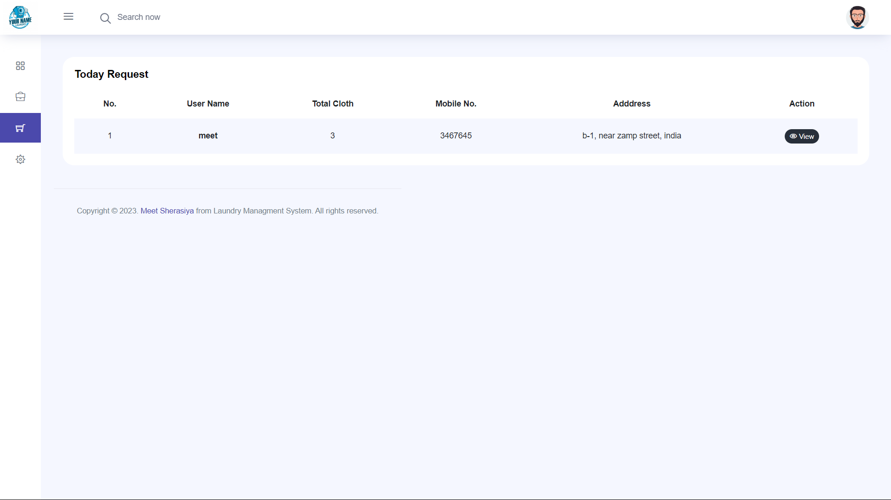
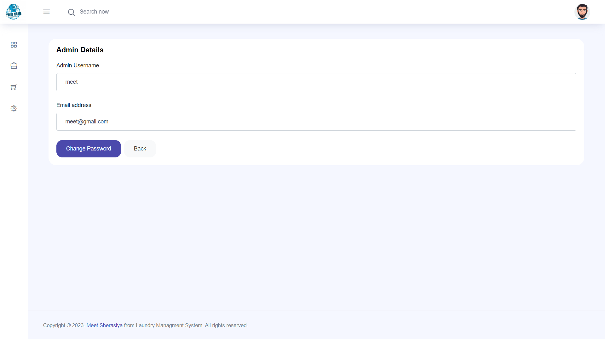
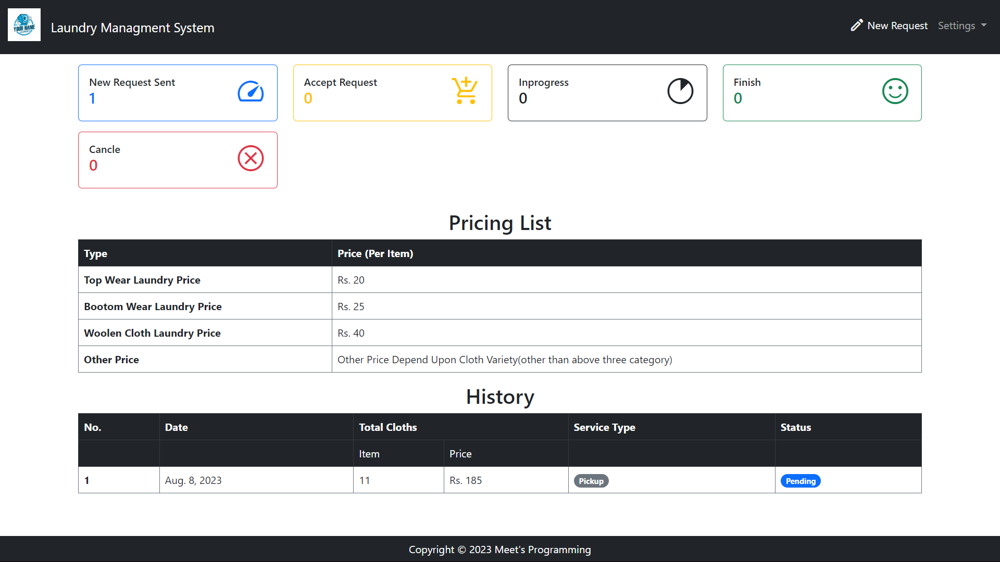
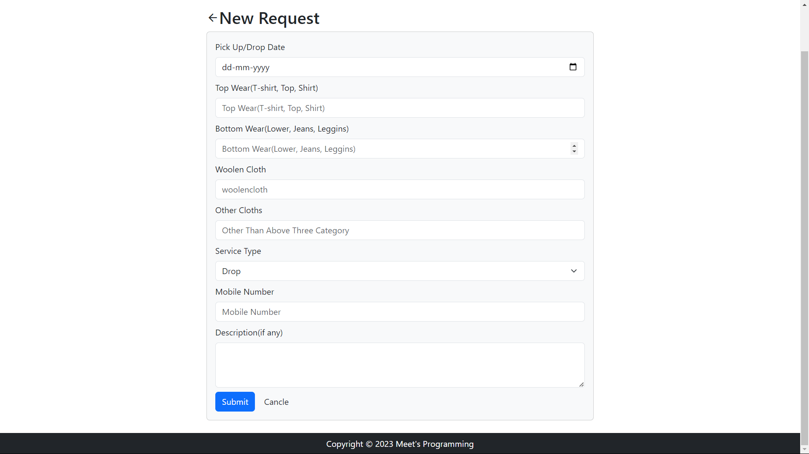
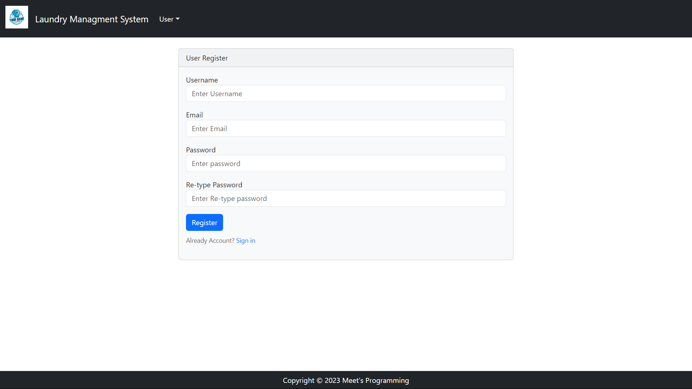

# Laundry Managment System

# Key Features:

1. User Registration and Authentication:
Users can create accounts and log in securely to access the system's features.
Authentication ensures that only authorized users can place laundry requests.

2. Order Placement:
Users can easily place new laundry requests, specifying their preferences and requirements.
They can select services like washing, drying, ironing, and folding.

3. Order Tracking:
The system provides real-time tracking of laundry orders from pick-up to delivery.
Users can check the status of their orders through the user dashboard.

4. Pick-up and Delivery Scheduling:
Users can schedule laundry pick-ups and deliveries at their preferred date and time.
The system ensures timely and efficient service to customers.

5. Admin Dashboard:
The admin interface provides a comprehensive dashboard with an overview of all laundry requests.
Admins can manage pending orders, view key metrics, and access analytics.

## Setup

The first thing to do is to clone the repository:

```sh
$ git clone https://github.com/MeetSherasiya/laundry_managment_system.git
$ cd laundry_managment_system
```

Create a virtual environment to install dependencies in and activate it:

```sh
$ virtualenv --no-site-packages env
$ source env/bin/activate
```

Then install the dependencies:

```sh
(env)$ pip install -r requirements.txt
```
Note the `(env)` in front of the prompt. This indicates that this terminal
session operates in a virtual environment set up by `virtualenv`.

Once `pip` has finished downloading the dependencies:
```sh
(env)$ cd laundry_managment_system
(env)$ python manage.py runserver
```
Add the Email SMTP Details in settings.py file
```sh
EMAIL_HOST_USER = 'Enter Email'
EMAIL_HOST_PASSWORD = 'Enter Password'
```

## Change the Company Email or Password with your Password for send the email from your account
Go to the General Settings in website and change email or password

And navigate to `http://127.0.0.1:8000/`.

# Admin View

## Home Page

<br>
<p>Request Page</p>

<br>
<p>Today Pick Up Page</p>

<br>
<p>General Setting Page</p>

<br>
<p>Admin Details Page</p>

<br>


# User View

## Home Page

<br>
<p>User Request Page</p>

<br>
<p>User Profile Page</p>

<br>
<p>User Register Page</p>

