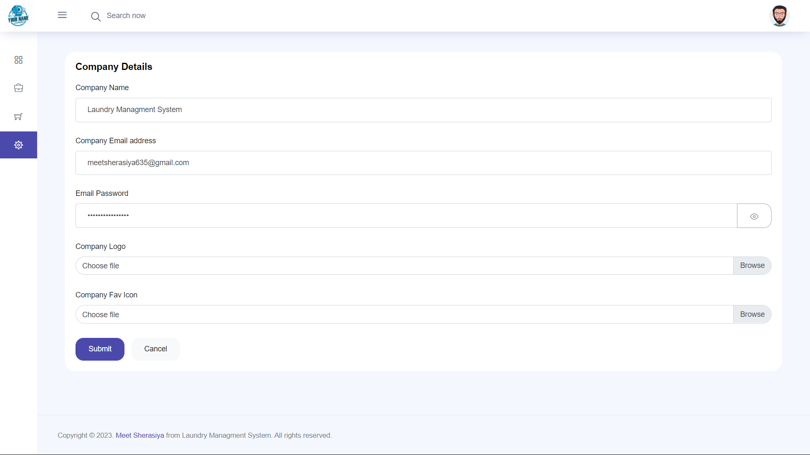
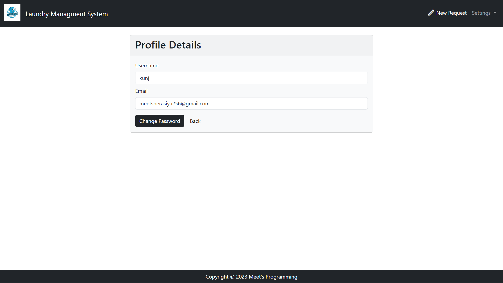

# Laundry Managment System

## Setup

The first thing to do is to clone the repository:

```sh
$ git clone https://github.com/MeetSherasiya/laundry_managment_system.git
$ cd laundry_managment_system
```

Create a virtual environment to install dependencies in and activate it:

```sh
$ virtualenv --no-site-packages env
$ source env/bin/activate
```

Then install the dependencies:

```sh
(env)$ pip install -r requirements.txt
```
Note the `(env)` in front of the prompt. This indicates that this terminal
session operates in a virtual environment set up by `virtualenv`.

Once `pip` has finished downloading the dependencies:
```sh
(env)$ cd laundry_managment_system
(env)$ python manage.py runserver
```
And navigate to `http://127.0.0.1:8000/`.

# Admin View

## Home Page

<br>
<p>Request Page</p>

<br>
<p>Today Pick Up Page</p>

<br>
<p>General Setting Page</p>

<br>
<p>Admin Details Page</p>

<br>


# User View

## Home Page

<br>
<p>User Request Page</p>

<br>
<p>User Profile Page</p>

<br>
<p>User Register Page</p>

